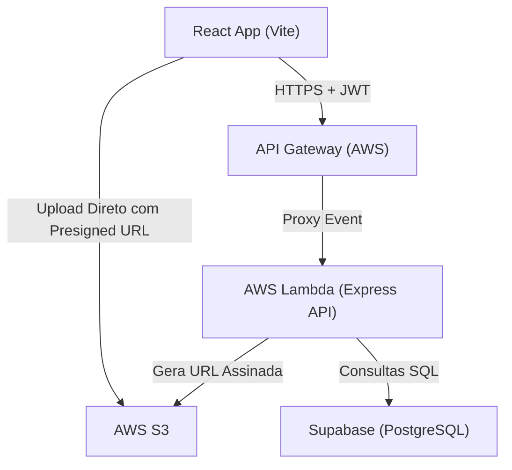

# UniSENAI SP — I Mostra de Projetos Integradores (Frontend)

Este repositório contém a aplicação frontend da **I Mostra de Projetos Integradores (2026)** da UniSENAI SP. A aplicação foi construída em **React** (utilizando **Vite** e **Tailwind CSS**) e integrada com uma API backend serverless hospedada em **AWS Lambda**.

---

## 1. Visão Geral da Arquitetura

O frontend interage diretamente com o ecossistema serverless no backend:



### Principais Integrações
- **Autenticação JWT**: Login e cadastro persistidos em `localStorage`. Envia cabeçalhos `Authorization: Bearer <token>` em todas as rotas protegidas da API.
- **Upload Direto via S3 (Presigned URLs)**: Evita sobrecarga da AWS Lambda (limite de payload de 6MB) gerando URLs pré-assinadas para uploads de artigos (PDF), slides (PDF), banners (imagens) e fotos do evento.

---

## 2. Tecnologias Utilizadas

- **Core**: React 18, Vite 6, Tailwind CSS 3
- **Roteamento**: React Router DOM v6
- **Gerenciamento de Estado de Dados**: TanStack React Query v5
- **Chamadas de API**: Axios (com interceptores de requisição/resposta)
- **Componentes de UI**: Radix UI, Lucide Icons, Shadcn-like CSS-variables
- **Notificações**: Sonner (toasts) e React Hot Toast

---

## 3. Configuração Local e Variáveis de Ambiente

Antes de iniciar a aplicação, crie um arquivo `.env` na raiz do projeto e configure a URL do seu backend local ou em produção:

```env
VITE_API_BASE_URL=http://localhost:3000
```

> [!NOTE]
> Para conectar-se diretamente com a API implantada na AWS Lambda em ambiente de desenvolvimento, altere o valor para a URL correspondente (ex: `https://ha4kdk8yh0.execute-api.sa-east-1.amazonaws.com/dev`).

---

## 4. Como Executar a Aplicação

### Execução Padrão (Local)

1. Instale as dependências:
   ```bash
   npm install
   ```

2. Inicie o servidor de desenvolvimento:
   ```bash
   npm run dev
   ```
   A aplicação estará rodando em `http://localhost:5173`.

3. Para gerar a build de produção:
   ```bash
   npm run build
   ```

### Execução via Docker (Opcional)

A aplicação já conta com suporte nativo para Docker e Docker Compose, configurado com Nginx para servir a build de produção na porta `3000`.

1. Suba o container:
   ```bash
   docker-compose up -d --build
   ```

2. Acesse a aplicação em: `http://localhost:3000`.

---

## 5. Estrutura de Código Relevante

- **`/src/api/apiClient.js`**: Instância do Axios com interceptores configurados para injetar tokens JWT nas requisições e realizar o auto-logout em caso de expiração (401/403).
- **`/src/lib/AuthContext.jsx`**: Provedor de autenticação que expõe o estado do usuário logado, perfil completo e funções de `login`, `register` e `logout`.
- **`/src/services/`**: Serviços do sistema que interagem com os endpoints REST do backend:
  - `projectService.js`: Gerencia projetos da mostra e upload via URLs pré-assinadas.
  - `criteriaService.js`: Gerencia listas de critérios de avaliação para professores.
  - `evaluationService.js`: Gerencia avaliações de projetos.
  - `groupService.js`: Gerencia formação de equipes/grupos de alunos.
  - `photoService.js`: Gerencia galeria colaborativa de fotos do evento.
  - `userService.js`: Gerencia a listagem e os papéis dos usuários.

---

## 6. Fluxo de Upload Direto para S3 (Vite + AWS S3)

O frontend implementa o fluxo seguro de upload direto para mídias pesadas:
1. O frontend chama `POST /projects/:id/upload-url` (ou `/photos/upload-url` para galeria), informando o nome e tipo do arquivo.
2. A API retorna uma **URL de Upload (Presigned URL)** e a **URL Final** pública do arquivo.
3. O React envia o arquivo binário direto para a **URL de Upload** usando um método `PUT` HTTP com os headers corretos do S3.
4. Concluído o upload, a API atualiza o banco de dados com a referência final do link público.

---

## 7. Deploy em Produção

A aplicação deve ser compilada e os arquivos da pasta `dist/` hospedados no bucket AWS S3 do frontend, distribuídos globalmente através da rede de borda do CloudFront.

Para gerar os arquivos estáticos prontos para produção:
```bash
npm run build
```
Envie o conteúdo gerado em `dist/` para a raiz do seu bucket S3 do frontend.
