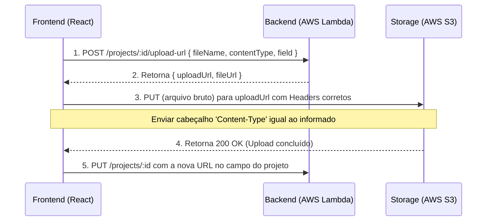

# Guia de Integração Frontend - UniSenai API

Este guia contém as especificações técnicas, endpoints ativos e fluxos necessários para integrar a aplicação frontend (React) hospedada na AWS (S3 + CloudFront com domínio personalizado) com a API Backend Serverless.

---

## 1. Informações de Conexão (Base URL & CORS)

*   **URL Base da API (Produção):**
    ```text
    https://ha4kdk8yh0.execute-api.sa-east-1.amazonaws.com/dev
    ```
*   **Configuração de CORS:**
    A API já está configurada para aceitar requisições de qualquer origem (`Access-Control-Allow-Origin: *`) e suporta os seguintes cabeçalhos e métodos:
    *   **Métodos:** `GET, POST, PUT, PATCH, DELETE, OPTIONS`
    *   **Cabeçalhos:** `Content-Type, Authorization`

---

## 2. Autenticação (JWT)

A maioria dos endpoints de escrita/modificação exige autenticação. 
*   **Como autenticar:** Enviar o token JWT recebido no login dentro do cabeçalho HTTP `Authorization` usando o formato `Bearer`:
    ```http
    Authorization: Bearer <seu_token_jwt_aqui>
    ```

---

## 3. Relação de Endpoints por Domínio

### 3.1. Autenticação & Usuários

| Método | Endpoint | Autenticação | Descrição |
| :--- | :--- | :---: | :--- |
| **POST** | `/register` | *Público* | Registra um novo usuário. |
| **POST** | `/login` | *Público* | Autentica o usuário e retorna o token JWT. |
| **POST** | `/auth/logout` | **JWT** | Notifica o logout. |
| **GET** | `/users/me` | **JWT** | Retorna as informações básicas decodificadas do token. |
| **GET** | `/users/profile` | **JWT** | Retorna o perfil completo do usuário atual. |
| **POST** | `/users/profiles` | **JWT** | Cria o perfil de usuário (se ainda não existir). |
| **GET** | `/users/profiles` | **JWT (Prof./Admin)** | Lista todos os perfis cadastrados (limitado a 200). |
| **PUT** | `/users/profiles/:id` | **JWT (Dono/Admin)** | Atualiza as informações do perfil. |
| **DELETE** | `/users/profiles/:id` | **JWT (Admin)** | Remove o perfil correspondente. |
| **POST** | `/users/invite` | **JWT (Admin)** | Pré-cadastra um e-mail de usuário com papel predefinido. |

---

### 3.2. Projetos (`/projects`)

| Método | Endpoint | Autenticação | Descrição |
| :--- | :--- | :---: | :--- |
| **GET** | `/projects/featured` | *Público* | Lista os 5 projetos aprovados mais recentes (Home). |
| **GET** | `/projects/approved` | *Público* | Lista todos os projetos com status aprovado. |
| **GET** | `/projects/approved-all` | *Público* | Lista até 100 projetos aprovados de forma paginada/ordenada. |
| **GET** | `/projects/oral` | *Público* | Lista projetos de apresentação oral (máx. 100). |
| **GET** | `/projects/mine` | **JWT** | Lista os projetos pertencentes ao usuário logado. |
| **GET** | `/projects/:id` | *Público* | Detalhes do projeto pelo ID (com avaliações embutidas). |
| **POST** | `/projects` | **JWT** | Cria um projeto (status inicial: `rascunho`). |
| **PUT** | `/projects/:id` | **JWT (Dono/Admin)** | Atualiza os dados de um projeto. |
| **DELETE** | `/projects/:id` | **JWT (Dono/Admin)** | Remove um projeto. |
| **POST** | `/projects/:id/submit` | **JWT (Dono)** | Envia o projeto para aprovação (altera status para `submetido`). |
| **POST** | `/projects/:id/upload-url` | **JWT (Dono/Admin)** | Solicita URL pré-assinada para upload de arquivos (Slides/Artigos/Banner). *Veja o fluxo no item 4.* |

---

### 3.3. Avaliações & Notas

| Método | Endpoint | Autenticação | Descrição |
| :--- | :--- | :---: | :--- |
| **GET** | `/evaluations/mine` | **JWT** | Lista as avaliações criadas pelo próprio usuário logado. |
| **GET** | `/projects/:projectId/evaluations` | **JWT (Prof./Admin)** | Lista as avaliações de um projeto específico. |
| **POST** | `/evaluations` | **JWT** | Cria uma nova avaliação (professor ou aluno). |
| **GET** | `/evaluations/project/:projectId/average` | **JWT** | Calcula e retorna as médias das notas do projeto em tempo real. |

---

### 3.4. Critérios de Avaliação (Professores)

| Método | Endpoint | Autenticação | Descrição |
| :--- | :--- | :---: | :--- |
| **GET** | `/criteria/mine` | **JWT (Professor)** | Lista as tabelas de critérios criadas pelo professor. |
| **POST** | `/criteria` | **JWT (Professor)** | Cria uma nova lista de critérios. |
| **PUT** | `/criteria/:id` | **JWT (Dono)** | Atualiza o nome/descrição da lista de critérios. |
| **DELETE** | `/criteria/:id` | **JWT (Dono)** | Exclui a lista de critérios correspondente. |
| **POST** | `/criteria/:id/items` | **JWT (Dono)** | Adiciona um critério individual `{name, description, weight}` à lista. |
| **PUT** | `/criteria/:id/items/:index` | **JWT (Dono)** | Atualiza o critério específico pelo seu índice no array. |
| **DELETE** | `/criteria/:id/items/:index` | **JWT (Dono)** | Remove o critério específico pelo seu índice no array. |

---

### 3.5. Grupos de Trabalho (Alunos)

| Método | Endpoint | Autenticação | Descrição |
| :--- | :--- | :---: | :--- |
| **GET** | `/groups/mine` | **JWT** | Lista os grupos liderados/criados pelo usuário. |
| **GET** | `/groups/member` | **JWT** | Lista os grupos dos quais o usuário faz parte como convidado. |
| **POST** | `/groups` | **JWT** | Cria um novo grupo. |
| **PUT** | `/groups/:id` | **JWT (Dono)** | Atualiza os dados cadastrais do grupo. |
| **DELETE** | `/groups/:id` | **JWT (Dono)** | Remove o grupo. |
| **POST** | `/groups/:id/invite` | **JWT (Dono)** | Convida um aluno pelo e-mail (status inicial: `pending`). |
| **PUT** | `/groups/:id/members/:memberEmail` | **JWT (Convidado)**| Aceita (`accepted`) ou recusa (`declined`) o convite para o grupo. |

---

### 3.6. Galeria de Fotos do Evento

| Método | Endpoint | Autenticação | Descrição |
| :--- | :--- | :---: | :--- |
| **GET** | `/photos` | *Público* | Lista todas as fotos públicas enviadas no evento. |
| **GET** | `/photos/mine` | **JWT** | Lista as fotos enviadas pelo usuário autenticado. |
| **POST** | `/photos/upload-url` | **JWT** | Gera URL pré-assinada do S3 e cadastra o registro da foto no banco. |
| **DELETE** | `/photos/:id` | **JWT (Dono/Admin)** | Exclui a foto do banco e deleta o arquivo no S3. |

---

## 4. Fluxo de Upload Direto para o S3 (Presigned URLs)

Para arquivos grandes (imagens, slides, artigos em PDF), **nunca envie os arquivos brutos para a Lambda**, pois há o limite de payload de 6MB da AWS. Em vez disso, use o fluxo de upload direto:



### Exemplo de Código no React (Axios)

```javascript
import axios from 'axios';

async function uploadFile(projectId, file, fieldType) {
  const token = localStorage.getItem('token');
  const headers = { Authorization: `Bearer ${token}` };

  // Passo 1: Obter a URL de upload pré-assinada
  const { data } = await axios.post(
    `https://ha4kdk8yh0.execute-api.sa-east-1.amazonaws.com/dev/projects/${projectId}/upload-url`,
    {
      fileName: file.name,
      contentType: file.type,
      field: fieldType // 'article_url', 'slides_url' ou 'banner_url'
    },
    { headers }
  );

  const { uploadUrl, fileUrl } = data;

  // Passo 2: Enviar o arquivo bruto diretamente para o S3
  // IMPORTANTE: O Content-Type deve ser idêntico ao informado no passo anterior!
  await axios.put(uploadUrl, file, {
    headers: {
      'Content-Type': file.type
    }
  });

  // Passo 3: Atualizar o banco de dados com a URL final gerada
  await axios.put(
    `https://ha4kdk8yh0.execute-api.sa-east-1.amazonaws.com/dev/projects/${projectId}`,
    {
      [fieldType]: fileUrl
    },
    { headers }
  );

  return fileUrl;
}
```
