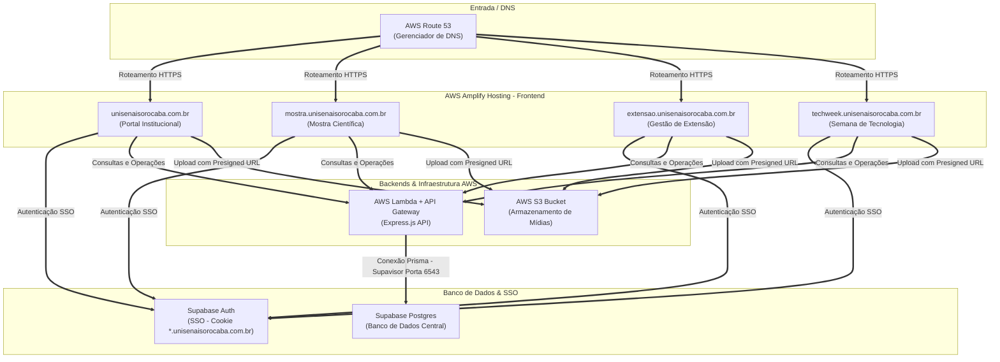
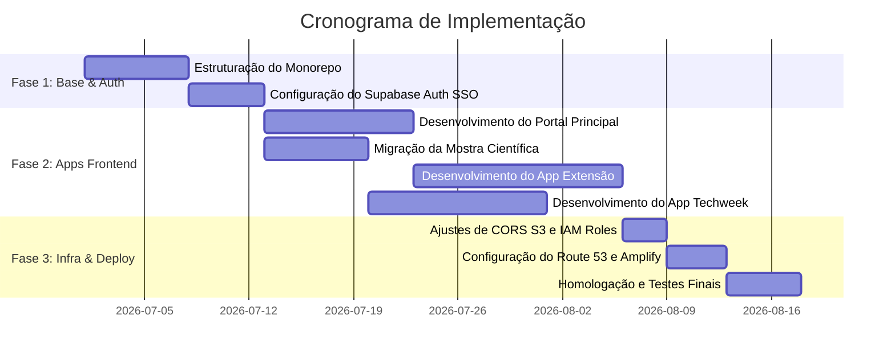

# Proposta de Reconstrução Arquitetural: Ecossistema UniSenai Sorocaba

Este documento formaliza a proposta de modernização e reestruturação da presença digital do **UniSenai Sorocaba**. O projeto visa a migração da infraestrutura atual para um modelo de múltiplos subdomínios integrados, com hospedagem de alta performance no **AWS Amplify** e autenticação única (Single Sign-On).

---

## 1. Objetivos do Projeto

* **Unificação de Marca e Serviços**: Consolidar múltiplos sistemas em uma experiência de navegação contínua sob o domínio institucional `unisenaisorocaba.com.br`.
* **Sessão Única (SSO)**: Permitir que alunos, professores e a comunidade acessem qualquer uma das sub-aplicações sem necessidade de logins múltiplos.
* **Preservação de Ativos Existentes**: Manter o banco de dados **Supabase** e o bucket de mídias **AWS S3** intactos, garantindo custo zero de perda de dados e uploads históricos.
* **Arquitetura Serverless**: Reduzir os custos operacionais de infraestrutura a quase zero durante períodos de baixo uso (férias acadêmicas) e garantir escalabilidade automática nos picos de acesso (semanas de eventos e avaliações).

---

## 2. Divisão de Subdomínios e Escopo Técnico

O ecossistema será composto por quatro aplicações frontend independentes hospedadas no AWS Amplify:

### 2.1. Portal Principal (`unisenaisorocaba.com.br` / `www.unisenaisorocaba.com.br`)
* **Público-alvo**: Alunos, professores, pais e comunidade externa.
* **Funcionalidades**:
  - Calendário acadêmico interativo.
  - Disponibilização dos Projetos Pedagógicos de Curso (PPCs).
  - Mural central de avisos e comunicados importantes.
  - Vitrine pública para exposição dos projetos de extensão.

### 2.2. Mostra de Projetos Integradores (`mostra.unisenaisorocaba.com.br`)
* **Público-alvo**: Alunos, professores avaliadores e visitantes do evento.
* **Funcionalidades**:
  - Inscrição e gerenciamento de equipes.
  - Submissão de projetos (artigos, banners, slides e links de pitch).
  - Módulo de avaliação com notas online e cálculo automático de médias.
  - Galeria histórica e ranking de projetos destacados.

### 2.3. Gestão de Projetos de Extensão (`extensao.unisenaisorocaba.com.br`)
* **Público-alvo**: Alunos, professores coordenadores e parceiros externos.
* **Funcionalidades**:
  - Cadastro de projetos sociais e de extensão.
  - Inscrições de alunos nas vagas disponíveis.
  - Controle de participação e cômputo de horas de extensão.
  - Painel de progresso com relatórios de impacto para a comunidade.

### 2.4. Tech Week (`techweek.unisenaisorocaba.com.br`)
* **Público-alvo**: Alunos, palestrantes e público externo.
* **Funcionalidades**:
  - Agenda completa da Semana de Tecnologia (palestras, minicursos e oficinas).
  - Credenciamento online e controle de vagas.
  - Painel administrativo para cadastro de palestrantes e cronogramas.
  - Emissão automática de certificados de participação integrados à presença.

---

## 3. Desenho de Arquitetura da Solução

O ecossistema adota uma arquitetura de microsserviços no frontend e monólito modular no backend, otimizando o reuso de recursos.



---

## 4. Solução de Autenticação Única (Single Sign-On)

Para unificar as sessões entre os subdomínios, propõe-se a migração para a **Opção C (Supabase Auth Nativo)**, com suporte a cookies compartilhados.

### Como funciona o fluxo:
1. O usuário realiza o login em qualquer subdomínio (ex: `techweek.unisenaisorocaba.com.br`).
2. O cliente do Supabase valida as credenciais e grava o token de acesso (JWT) em um cookie do navegador configurado para o domínio pai com um ponto (`.`) à esquerda:
   - **Configuração do Cookie**: `Domain=.unisenaisorocaba.com.br; Secure; SameSite=Lax`
3. Quando o usuário navega para outro subdomínio (ex: `mostra.unisenaisorocaba.com.br`), o navegador envia automaticamente este cookie. O SDK do Supabase detecta a sessão ativa localmente no carregamento da página.
4. O login é automático e imperceptível, sem necessidade de redirecionar o usuário a telas externas.

### Vantagens da Opção C:
* **Integração com Azure AD / Office 365**: Possibilidade de habilitar o login corporativo institucional do SENAI com poucos cliques.
* **Segurança Profissional**: Controle nativo de sessões, recuperação de senhas por e-mail transacional, criptografia PKCE e conformidade com a LGPD.

---

## 5. Estratégia de Rede, DNS e Mídias (AWS e Supabase)

### 5.1. Roteamento de DNS (AWS Route 53)
* Como o domínio `unisenaisorocaba.com.br` no Registro.br já aponta para os servidores da AWS Route 53, o mapeamento será direto no painel do AWS Amplify.
* O AWS Amplify configurará os registros de DNS de forma automatizada e emitirá certificados de segurança digitais HTTPS (SSL/TLS) válidos para todas as rotas.

### 5.2. Preservação dos Uploads e Configuração do S3
* **Sem Perda de Arquivos**: O bucket S3 atual (`unisenai-mostra-uploads`) continuará ativo. Todos os caminhos de arquivos registrados nas tabelas do Supabase permanecerão inalterados.
* **Melhoria de Segurança (IAM Roles)**: Substituição de chaves de acesso estáticas no código por permissões temporárias obtidas via IAM Execution Role na Lambda, de acordo com as boas práticas da AWS.
* **Ajuste de CORS**: O bucket S3 será configurado para aceitar requisições de upload direto de qualquer origem sob o domínio `*.unisenaisorocaba.com.br`.

---

## 6. Organização de Desenvolvimento (Estrutura Monorepo)

Visando a facilidade de manutenção e rapidez de desenvolvimento, a base de código será organizada como um **Monorepo**. Isso permite compartilhar a folha de estilos Tailwind CSS e o kit de componentes Shadcn/React entre todos os projetos de forma instantânea.

```
unisenai-workspace/
├── api/                        # Backend Express.js em Lambda e Prisma Schema
├── packages/
│   ├── ui-shared/              # Layouts, botões, modais e estilos comuns
│   └── auth-shared/            # Configuração e hooks do Supabase Client para SSO
└── apps/
    ├── portal-main/            # Código de unisenaisorocaba.com.br
    ├── site-mostra/            # Código de mostra.unisenaisorocaba.com.br
    ├── site-extensao/          # Código de extensao.unisenaisorocaba.com.br
    └── site-techweek/          # Código de techweek.unisenaisorocaba.com.br
```

---

## 7. Cronograma e Etapas Sugeridas para Implementação



---

## 8. Conclusão e Próximos Passos

Esta proposta oferece uma arquitetura madura, profissional e alinhada com as melhores práticas de nuvem. Ela garante isolamento completo dos ambientes de frontend para evitar que problemas em uma aplicação afetem as demais, ao mesmo tempo em que oferece uma experiência integrada e fluida de Single Sign-On para a comunidade acadêmica.

Para iniciar a execução, as seguintes decisões devem ser tomadas:
1. Aprovação da migração para o **Supabase Auth** (Opção C) como provedor central de identidade.
2. Definição se os novos portais adotarão o mesmo estilo visual do aplicativo da Mostra atual.
3. Autorização para o início da estruturação do repositório no modelo Monorepo.
